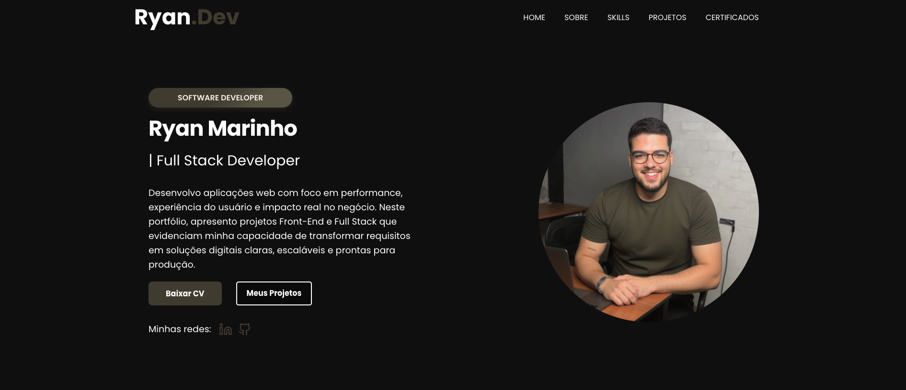

# Portfolio - Ryan Marinho

Portfolio profissional com foco em projetos Front-End e Full Stack, destacando experiencia pratica em entrega de produto ponta a ponta, integracao com APIs e desenvolvimento orientado a qualidade.

## Visao Geral

Este projeto apresenta:

- Minha apresentacao profissional e stack principal.
- Projetos freelancer e projetos de estudo com descricao tecnica objetiva.
- Certificados e links de contato para recrutadores e parceiros.

## Tecnologias Utilizadas

### Front-End

- React
- TypeScript
- JavaScript
- HTML
- CSS
- React Router DOM
- ScrollReveal
- React Slick

### Ferramentas

- Vite
- ESLint
- Git e GitHub

## Estrutura do Projeto

src/Components contem as secoes principais do portfolio:

- Home
- Sobre
- Skills
- Projetos
- Certificados
- Rodape

## Como Executar Localmente

1. Clone o repositorio.
2. Instale as dependencias.
3. Rode o servidor de desenvolvimento.

Comandos:

- npm install
- npm run dev

Para build de producao:

- npm run build
- npm run preview

## Scripts Disponiveis

- npm run dev: inicia ambiente de desenvolvimento.
- npm run build: gera build de producao.
- npm run preview: sobe preview local do build.
- npm run lint: executa analise de padrao de codigo.

## Diferenciais do Portfolio

- Comunicacao clara entre contexto de negocio e implementacao tecnica.
- Projetos com foco em performance, usabilidade e manutencao.
- Apresentacao objetiva para avaliacao tecnica e recrutamento.

## Contato

- LinkedIn: https://www.linkedin.com/in/ryan-marinho-861120211/
- GitHub: https://github.com/ryanmarinhodev
- E-mail: ryanmarinhodev@gmail.com

## Status

Em evolucao continua com novos projetos, melhorias de conteudo e refinamento de experiencia.
